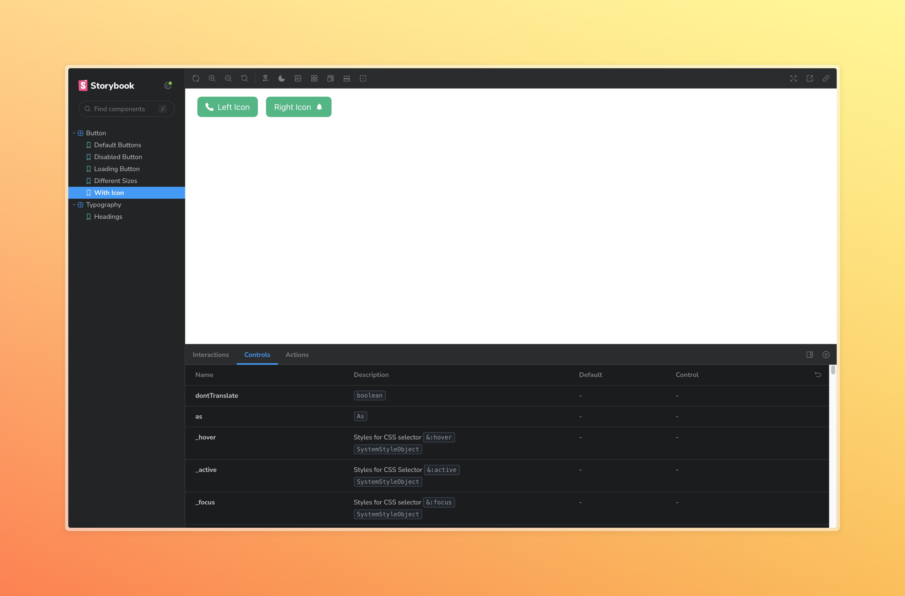
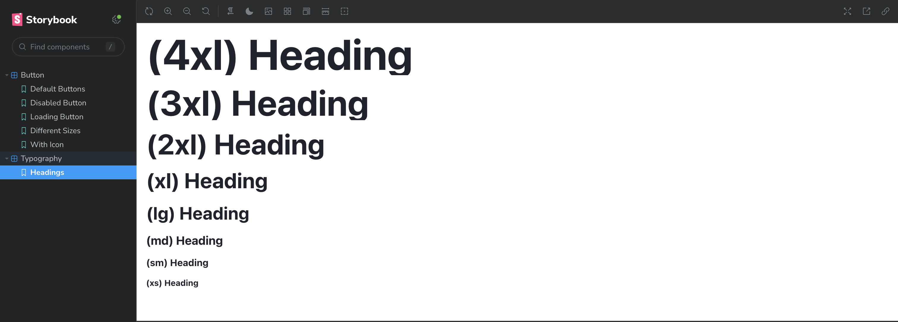
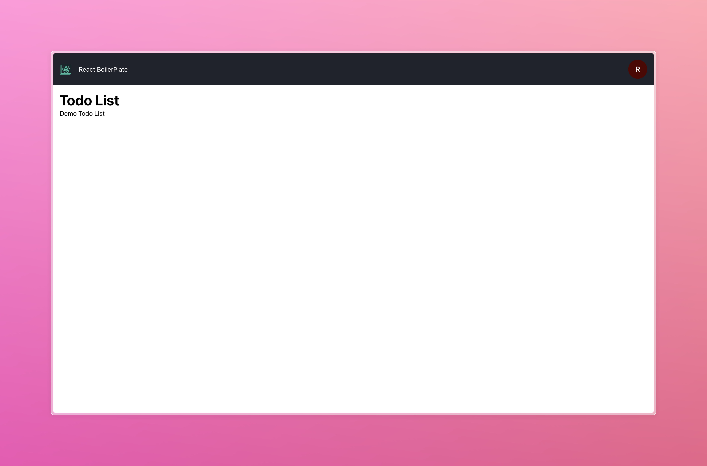

[![Contributors][contributors-shield]][contributors-url]
[![Forks][forks-shield]][forks-url] [![Stargazers][stars-shield]][stars-url]
[![Issues][issues-shield]][issues-url] ![license-shield]
<a name="readme-top"></a>

<br />
<div align="center">
  <a href="https://github.com/sangit0/react-boilerplate-clean-code-architecture">
    
  </a>

  <h3 align="center">React - Clean Architecture Boilerplate</h3>

  <p align="center">
    This boilerplate provides a structured foundation for React projects, adhering to the principles of Clean Architecture. It promotes a layered organization of code, enhancing maintainability and scalability.
  </p>

 
 </div>
 <br/> <br/>

    Some screenshots of the home page and typography page of the boilerplate.

<div align="center">
     
    
</div>
<br/> <br/>

<p align="right">(<a href="#readme-top">back to top</a>)</p>

## Built with

- [![React][React.js]](https://reactjs.org/)
- [![ReactRouter][ReactRouter]](https://reactrouter.com/)
- [![ReactQuery][ReactQuery]](https://react-query.tanstack.com/)
- [![ChakraUI][ChakraUI]](https://chakra-ui.com/)
- [![ReactHookForm][ReactHookForm]](https://react-hook-form.com/)
- [![ESLint][ESLint]](https://eslint.org/)
- [![Prettier][Prettier]](https://prettier.io/)
- [![Husky][Husky]](https://typicode.github.io/husky/#/)
- ![LintStaged][LintStaged]
- [![CommitLint][CommitLint]](https://commitlint.js.org/)
- [![Storybook][Storybook]](https://storybook.js.org/)

## Getting Started

To get a local copy up and running follow these simple example steps.

### Installation

_Below is an example of how you can instruct your audience on installing and
setting up your app. This template doesn't rely on any external dependencies or
services._

1. Clone the repo
   ```sh
   git clone https://github.com/sangit0/react-boilerplate-clean-code-architecture.git
   ```
2. Install NPM packages
   ```sh
   npm install
   ```

<p align="right">(<a href="#readme-top">back to top</a>)</p>

## Clean Architecture Overview

[](https://blog.cleancoder.com/uncle-bob/2012/08/13/the-clean-architecture.html)

Clean Architecture segregates the codebase into layers, each with distinct
responsibilities. This separation of concerns simplifies maintenance, testing,
and scaling. The core principle is to keep business logic independent of the
presentation and infrastructure layers, allowing changes in implementation
without affecting other layers.

Read more about Clean Architecture
[here](https://blog.cleancoder.com/uncle-bob/2012/08/13/the-clean-architecture.html).

## Clean Architecture Layers

- **Presentation**: Handles UI rendering. Contains components, pages, and
  styles. Depends on external libraries like React, Chakra UI, etc.
- **Infrastructure**: Manages side effects, such as API calls, local storage,
  etc. Includes services, repositories, and hooks interacting with external
  services.
- **Application**: Contains the business logic. Includes use cases and domain
  logic. It's the heart of the application and should be independent of the
  presentation and infrastructure layers.

### Project Structure

```
src
|── assets
├── adapters // Infrastructure Layer
│   ├── api
│   ├── storage
├── core // Application Layer
│   ├── use-cases
│   ├── entities
├── lib // Third Party Libraries
    |── ui
        |── elements
        |── Button
        |── forms
        |── utils
        |── providers
├── pages // Presentation Layer
    |── Home
    |── About
    |── Contact
├── routes

```

## Project Structure Overview

- **Assets**: Contains static assets like images, fonts, etc.
  ```
  src
  |── assets
  |   ├── images
  |   ├── icons
  |   ├── fonts
  ```
- **Adapters**: Infrastructure layer that interacts with external services.
  Includes API calls, local storage, etc.
  ```
  src
  |── adapters
  |   ├── api
  |       ├── client
  |       ├── graphql
  |   ├── storage
  |       ├── localStorage
  |       ├── sessionStorage
  ```
- **Core**: Application layer that contains the business logic. Includes use
  cases and domain logic.
  ```
  src
  |── core
  |   ├── domain
  |       ├── user
  |       ├── post
  |   ├── use-cases
  |       ├── user
  |           ├── createUser
  |           ├── getUser
  |           ├── updateUser
  |       ├── post
  ```
- **Lib**: Contains third-party libraries and utilities.
  ```
  src
  |── lib
  |   ├── ui
          |── layout
  |       ├── elements
  |           ├── Button
  |           ├── Input
  |       ├── forms
  |           ├── Form
  |           ├── Field
  |       ├── utils
  |           ├── useBreakpointValue
  |           ├── useDebounce
  |       ├── providers
  |           ├── ThemeProvider
  |           ├── QueryClientProvider
  ```
- **Pages**: Presentation layer that contains components and pages. Each page
  represents a route in the application.
  ```
  src
  |── pages
  |   ├── Home
  |   ├── About
  |   ├── Contact
  ```
- **Routes**: Contains route definitions. Each route is mapped to a component in
  the `pages` directory.

## Best Practices

- **Dependencies**: Each layer should depend only on the layer below it. For
  example, the presentation layer can depend on the application and
  infrastructure layers, but the application layer should not depend on the
  presentation layer.

- **Separation of Concerns**: Each layer should have a single responsibility and
  should not mix concerns. For example, the presentation layer should only be
  responsible for rendering the UI and should not contain any business logic.

- **Testability**: By separating the code into layers, it becomes easier to test
  each layer independently. For example, you can test the application layer
  without having to render any components.

- **Scalability**: By following the Clean Code Architecture principles, your
  codebase becomes more scalable and maintainable. It is easier to add new
  features or refactor existing ones without breaking the code.

- **Flexibility**: The Clean Code Architecture allows you to change the
  implementation details of each layer without affecting the other layers. For
  example, you can switch from one state management library to another without
  changing the application logic.

## Best Practices - For Clean Code Architecture

- Prefer functional components and hooks. Avoid class components unless
  necessary.
- Design components to be reusable and composable.
- Keep components small and focused on a single responsibility.
- Limit components to UI rendering. Use hooks or context for state and business
  logic.
- Extract business logic into `src/core/use-cases`.
- Make business logic testable and independent of the presentation layer.
- Decouple business logic from external services and libraries.
- Keep business logic pure and side-effect free.
- Avoid complex logic. Prefer clear, simple solutions.
- Wrap third-party libraries in custom components or hooks.
- Isolate third-party libraries from the rest of the codebase.
- Make third-party libraries easy to replace or upgrade.

## Coding Standards and Conventions

- **File Naming**: Use PascalCase for component names and camelCase for other
  files. For example, `Button.js` and `useButton.js`.
- **Folder Structure**: Use a flat folder structure for components and a nested
  structure for other files. For example, `src/lib/ui/elements/Button.tsx` and
  `src/core/use-cases/auth/login.js`.
- **Code Formatting and Linting**: Use Prettier for code formatting and ESLint
  for linting.
- **Code Comments**: Use comments sparingly and only when necessary.
- **Function Naming**: Use descriptive function names that explain what the
  function does. Avoid generic names like `handleClick` or `handleSubmit`.
- **Variable Naming**: Use descriptive variable names that explain what the
  variable represents. Avoid single-letter variable names like `i` or `j`.
- **Single Responsibility Principle**: Each function or component should have a
  single responsibility and do it well. Avoid functions or components that do
  too much.
- **Don't Repeat Yourself (DRY)**: Avoid duplicating code by extracting common
  logic into reusable functions or components.
- **Consistent Code Style**: Use a consistent code style throughout your
  codebase for better readability and maintainability.

## Features

- **Routing**: React Router for declarative routing. Define routes in
  `src/routes/routes-path.ts`. From there, the routes are imported into
  `src/routes/index.tsx` and rendered in `src/App.tsx`. You will be able to
  access the routes path string using `RoutesPath.<RouteName>`.

- **Translataion**: `i18next` for internationalization is set up. You can define
  own internationalization package in `src/lib/translation/Translation.ts`.
  `init()` function is called in `src/App.tsx` to initialize the translation
  package. `useTranslate` hook is available to use in components. You can
  customize the translation package as per your requirements and `useTranslate`
  hook.

- **Chakra UI**: Chakra UI for styling components. You can define your own theme
  in `src/lib/ui/theme`. You can use Chakra UI components in
  `src/lib/ui/elements` and `src/lib/ui/forms`. Elements wrapped from Chakra UI
  components are available in `src/lib/ui/elements` and form components are
  available in `src/lib/ui/forms`.

- **React Query**: Coming Soon

- **React Hook Form**: Coming Soon with Chakara UI form components.

## [![Storybook][Storybook]](https://storybook.js.org/)

Storybook is a tool for developing UI components in isolation. It helps you
build components and present them interactively with different states.

To start Storybook, run:

```bash
pnpm storybook
```

Open [http://localhost:6006](http://localhost:6006) to view it in the browser.

## Linting and Formatting

Husky is set up to run linting and formatting checks before committing code.
This ensures that the codebase follows consistent coding standards. But you can
also run these checks manually.

ESLint and Prettier are set up to enforce code quality and formatting rules. You
can run linting and formatting checks using the following commands:

```bash
pnpm lint
```

```bash
pnpm format
```

## Commit Guidelines

This project uses Commit Lint to enforce commit message conventions. Commit
messages should follow the conventional commit format:

```bash
<type>(<scope>): <subject>
```

Where `<type>` is one of the following:

- `feat`: A new feature
- `fix`: A bug fix
- `docs`: Documentation changes
- `style`: Code style changes
- `refactor`: Code refactoring
- `test`: Test cases
- `chore`: Other changes

`<scope>` is optional and can be anything specifying the location of the commit
change.

`<subject>` is a brief description of the change.

## [![License][license-shield]](LICENSE)

This project is licensed under the MIT License.

[React.js]:
  https://img.shields.io/badge/React-20232A?style=for-the-badge&logo=react&logoColor=61DAFB
[contributors-shield]:
  https://img.shields.io/github/contributors/sangit0/react-starter-kit-chakra?style=for-the-badge
[contributors-url]:
  https://github.com/sangit0/react-boilerplate-clean-code-architecture/graphs/contributors
[forks-shield]:
  https://img.shields.io/github/forks/sangit0/react-starter-kit-chakra?style=for-the-badge
[forks-url]: https://github.com/sangit0/react-boilerplate-clean-code-architecture/fork
[stars-shield]:
  https://img.shields.io/github/stars/sangit0/react-starter-kit-chakra?style=for-the-badge
[stars-url]: https://github.com/sangit0/react-boilerplate-clean-code-architecture/stargazers
[issues-shield]:
  https://img.shields.io/github/issues/sangit0/react-starter-kit-chakra?style=for-the-badge
[issues-url]: https://github.com/sangit0/react-boilerplate-clean-code-architecture/issues
[license-shield]:
  https://img.shields.io/github/license/sangit0/react-starter-kit-chakra?style=for-the-badge
[ReactRouter]:
  https://img.shields.io/badge/React_Router-CA4245?style=for-the-badge&logo=react-router&logoColor=white
[ReactQuery]:
  https://img.shields.io/badge/React_Query-000000?style=for-the-badge&logo=react-query&logoColor=FF4154
[ChakraUI]:
  https://img.shields.io/badge/Chakra_UI-319795?style=for-the-badge&logo=chakra-ui&logoColor=white
[ReactHookForm]:
  https://img.shields.io/badge/React_Hook_Form-20232A?style=for-the-badge&logo=react-hook-form&logoColor=61DAFB
[ESLint]:
  https://img.shields.io/badge/ESLint-4B32C3?style=for-the-badge&logo=eslint&logoColor=white
[Prettier]:
  https://img.shields.io/badge/Prettier-F7B93E?style=for-the-badge&logo=prettier&logoColor=white
[Husky]:
  https://img.shields.io/badge/Husky-316FFF?style=for-the-badge&logo=husky&logoColor=white
[LintStaged]:
  https://img.shields.io/badge/Lint_Staged-316FFF?style=for-the-badge&logo=lint-staged&logoColor=white
[CommitLint]:
  https://img.shields.io/badge/Commit_Lint-316FFF?style=for-the-badge&logo=commitlint&logoColor=white
[Storybook]:
  https://img.shields.io/badge/Storybook-FF4785?style=for-the-badge&logo=storybook&logoColor=white
